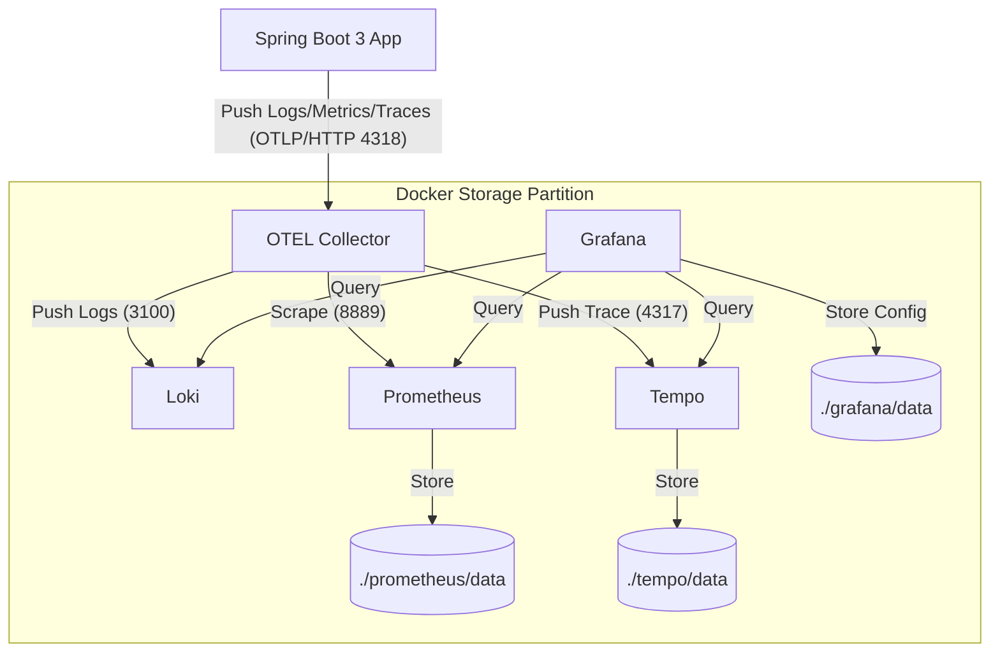

```shell
cd script/docker/monitor
chmod -R 777 ./grafana/data
chmod -R 777 ./prometheus/data
# 运行
docker compose -p monitor up -d
# 停止
docker compose -p monitor down
```

- 验证 Prometheus：访问 http://localhost:9090，在 Status -> Targets 查看 otel-collector 是否为绿色的 UP 状态。
- 验证 Grafana： 访问 http://localhost:3000 (admin/admin@123)，查看 prometheus、tempo、loki 数据源
  - 通过 Explore -> loki 查询日志，点击日志通过`links`中的`Tempo`按钮跳转链路
  - 通过 Explore -> tempo 查询链路，点击实际`traceId`通过 `Logs for this span` 按钮跳转链路日志

