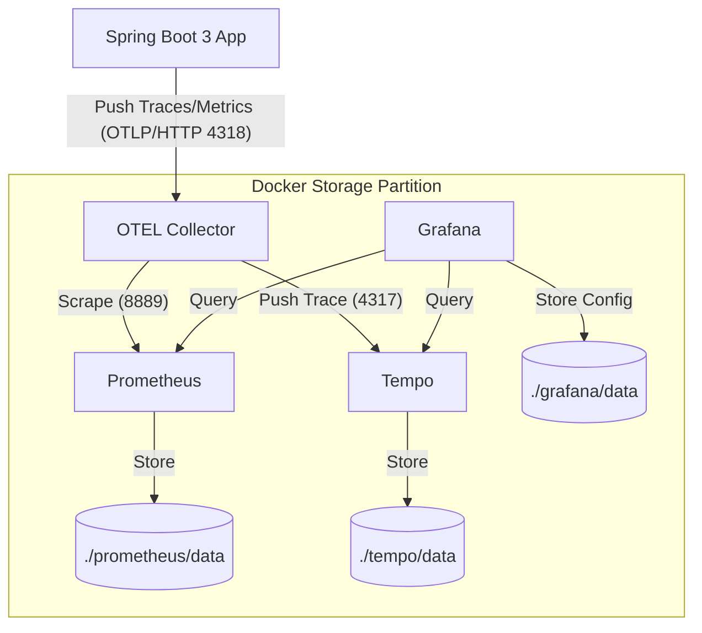

```shell
cd script/docker/monitor
chmod -R 777 ./grafana/data
chmod -R 777 ./prometheus/data
# 运行
docker compose -p monitor up -d
# 停止
docker compose -p monitor down
```

验证 Prometheus：访问 http://localhost:9090，在 Status -> Targets 查看 otel-collector 是否为绿色的 UP 状态。
验证 Grafana：

访问 http://localhost:3000 (admin/admin@123)。

添加 Prometheus 数据源，URL 填写 http://prometheus:9090。
添加 Tempo 数据源，URL 填写 http://tempo:3200。
打通 Metrics 和 Traces（进阶）：
在 Tempo 数据源配置中，有一个 "Derived Fields" 或 "Service Graph" 部分。

关联 Prometheus 数据源，这样你就可以在查看 CPU 异常时，直接点击跳转到当时的 Trace 链路。

导入 Dashboard

查询 Trace：

进入 Grafana 的 Explore 菜单。

选择 Tempo 数据源。

选择 Search 标签，点击 "Run Query"，就能看到 Spring Boot 应用发出的请求链路了。

